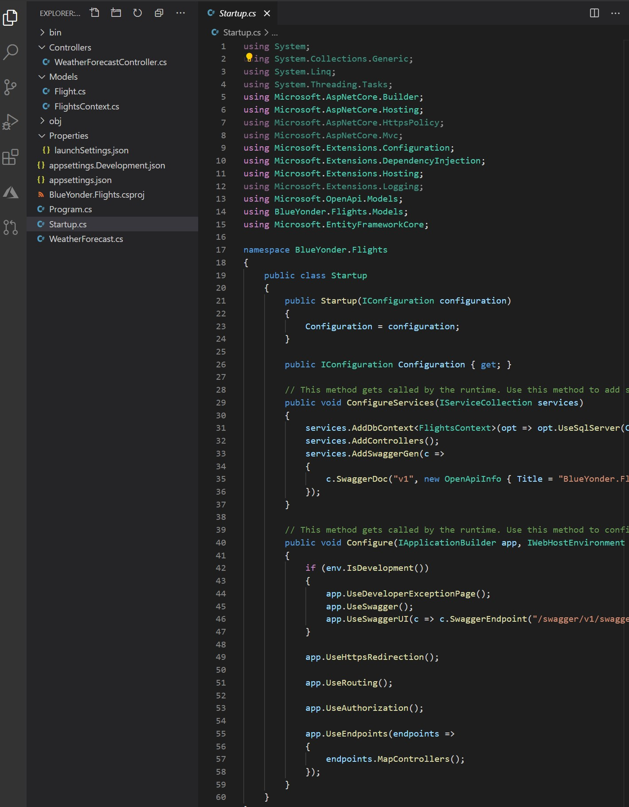

# Module 1: Overview of Service and Cloud Technologies

# Lab: Exploring the Work Environment

1. **Nombres y apellidos:** Francisco Javier Moreno Quevedo
2. **Fecha:** 17/12/2020
3. **Resumen del Ejercicio:**  Crear el modelo con entity Framework
4. **Dificultad o problemas presentados y como se resolvieron:** Ninguna

- Ejercicio 2: Creating a Simple Entity Framework Model

  - Añadimos el paquete Microsoft.EntityFrameworkCore.SqlServer

  - Añadimos la carpeta Models
  
  - Añadimos la clase Flight y el DBcontext del proyecto

  - Añadimos en el middleware el dbcontext

    
  
  

